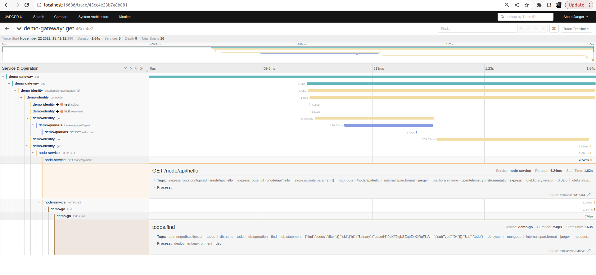

# code-with-open-trace Project
## Run all images for execution
```shell script
$ docker run -d --name jaeger \
  -e COLLECTOR_ZIPKIN_HOST_PORT=:9411 \
  -e COLLECTOR_OTLP_ENABLED=true \
  -p 6831:6831/udp \
  -p 6832:6832/udp \
  -p 5778:5778 \
  -p 16686:16686 \
  -p 4317:4317 \
  -p 4318:4318 \
  -p 14250:14250 \
  -p 14268:14268 \
  -p 14269:14269 \
  -p 9411:9411 \
  jaegertracing/all-in-one:1.39

```

##   <ins> 1. Spring boot Application for Open Tracing  </ins>
## Add the following dependency for tracing 

```shell script
1. For tracing
implementation 'org.springframework.cloud:spring-cloud-starter-sleuth' \\ for managing tracing

2. For zipkin
implementation 'org.springframework.cloud:spring-cloud-sleuth-zipkin'   \\ for sending traces to collector

3.Database log 
implementation 'p6spy:p6spy:3.9.1'                                      \\ for tracing DB transactions
```
## Apply the configuration

```shell script
***********application.yml*************
spring:
  sleuth:
  propagation:
    type: B3
  jdbc:
    p6spy:
      tracing:
        include-parameter-values: false
  zipkin:
    baseUrl: http://127.0.0.1:9411/

#To view request related logs in console (doesn't work for gateway):
logging:
  level:
    org:
      springframework:
        web:
          servlet:
            DispatcherServlet: DEBUG
```

##   <ins> 2.  Quarkus Application for Open Tracing  </ins>
If you want to learn more about Quarkus open tracing , please visit its website: [https://quarkus.io/guides/opentelemetry](https://quarkus.io/guides/opentelemetry)

## Dependency need to be added to implement the open distributed tracing.
```shell script
** Implement Tracing add the following dependency ***
implementation("io.quarkus:quarkus-opentelemetry")
```

```shell script
** The JDBC instrumentation will add a span for each JDBC queries done by your application, to enable it, add the following dependency   ***
implementation("io.quarkus:quarkus-opentelemetry")
```
```shell script
** OpenTelemetry propagates cross-cutting concerns through propagators that will share an underlying Context for storing state and accessing data across the lifespan of a distributed transaction ***
1. for The b3, b3multi, jaeger and ottrace propagator we need to add following 
implementation("io.opentelemetry:opentelemetry-extension-trace-propagators")

2.The xray propagator will need the aws extension to be added as a dependency
implementation("io.opentelemetry:opentelemetry-extension-aws")
```
### Apply the configuration
```shell script
**************application.properties***********
quarkus.application.name=myservice  
quarkus.opentelemetry.propagators=b3,baggage
quarkus.opentelemetry.enabled=true
quarkus.opentelemetry.tracer.exporter.otlp.endpoint=http://localhost:4317
quarkus.log.console.format=%d{HH:mm:ss} %-5p traceId=%X{traceId}, parentId=%X{parentId}, spanId=%X{spanId}, sampled=%X{sampled} [%c{2.}] (%t) %s%e%n
quarkus.http.access-log.pattern="...traceId=%{X,traceId} spanId=%{X,spanId}"
```

## Running the application in dev mode

You can run your application in dev mode that enables live coding using:
```shell script
./gradlew --console=plain quarkusDev
```

## View Tracing Information 
Then visit the [Jaeger UI(http://localhost:16686/)](http://localhost:16686/) to see the tracing information.

## image :


 
## Node Poc with opentelementry

1. Node v10+ is supported by OpenTelemetry.

2. Install to following packages for opentelementry
``` 
npm install --save @opentelemetry/api 
npm install --save @opentelemetry/sdk-trace-node
npm install --save opentelemetry-instrumentation-express
npm install --save @opentelemetry/instrumentation-mongodb
npm install --save @opentelemetry/instrumentation-http
npm install --save express
npm install --save mongodb //for poc perpose 
npm install --save @opentelemetry/exporter-jaeger
``` 
#### Add B3 Propogation (Read from : https://www.npmjs.com/package/@opentelemetry/propagator-b3)
``` 
npm i @opentelemetry/propagator-b3
``` 
// after download package add following code in tracing.js
``` 
const api = require('@opentelemetry/api');
const { CompositePropagator } = require('@opentelemetry/core');
const { B3Propagator, B3InjectEncoding } = require('@opentelemetry/propagator-b3');
api.propagation.setGlobalPropagator(
  new CompositePropagator({
    propagators: [
      new B3Propagator(),
      new B3Propagator({ injectEncoding: B3InjectEncoding.MULTI_HEADER }),
    ],
  })
);

``` 
3. Create Tracing file tracing.js

4. Run your application and execute a few requests

5. use your browser to view Jaeger UI at  http://localhost:16686/
## Go Service  (Note : for this poc we use mongodb)
### Install packages
- Install Gin and Mongo-driver
``` 
    go get -u github.com/gin-gonic/gin 
    go get go.mongodb.org/mongo-driver/mongo
```
- To install the OTel SDK, run:
``` 
    go get go.opentelemetry.io/otel 
    go.opentelemetry.io/otel/sdk 
``` 
- Gin instrumentation: Install otelgin
``` 
   go get go.opentelemetry.io/contrib/instrumentation/github.com/gin-gonic/gin/otelgin
``` 
- Mongo instrumentation: Install otelmongo
``` 
   go get go.opentelemetry.io/contrib/instrumentation/go.mongodb.org/mongo-driver/mongo/otelmongo
``` 
- Propagation Configuration

``` 
    Install pcakge 
    go get go.opentelemetry.io/contrib/propagators/b3"
    [Single Header: b3: {TraceId}-{SpanId}-{SamplingState}-{ParentSpanId}
   Multiple Headers: x-b3-traceid: {TraceId} x-b3-parentspanid: {ParentSpanId} x-b3-spanid: {SpanId} x-b3-sampled: {SamplingState} x-b3-flags: {DebugFlag}]

    for single header ,
    p := b3.New()\
	// Register the B3 propagator globally.\
	otel.SetTextMapPropagator(p)\

    for single and multiheader\
    p := b3.New(b3.WithInjectEncoding(b3.B3MultipleHeader | b3.B3SingleHeader))\
	otel.SetTextMapPropagator(p)\
``` 
- OpenTelemetry Go and Jaeger Tracing: Export traces to Jaeger (Visualization with Jaeager)\
1) Install the Jaeger exporter
``` 
    go get go.opentelemetry.io/otel/exporters/jaeger
``` 
2) create tracing file and add following code(tracing.go):
``` 
package tracing
import (\
  "go.opentelemetry.io/otel/exporters/jaeger"
  "go.opentelemetry.io/otel/sdk/resource"
  sdktrace "go.opentelemetry.io/otel/sdk/trace"
  semconv "go.opentelemetry.io/otel/semconv/v1.4.0"
)
func JaegerTraceProvider() (*sdktrace.TracerProvider, error) {
  exp, err := jaeger.New(jaeger.WithCollectorEndpoint(jaeger.WithEndpoint("http://localhost:14268/api/traces")))
  if err != nil {
      return nil, err
  }
  tp := sdktrace.NewTracerProvider(
      sdktrace.WithBatcher(exp),
      sdktrace.WithResource(resource.NewWithAttributes(
          semconv.SchemaURL,
          semconv.ServiceNameKey.String("do-demo"), // name of the service 
          semconv.DeploymentEnvironmentKey.String("dev"),
      )),
  )
  return tp, nil
}
``` 


